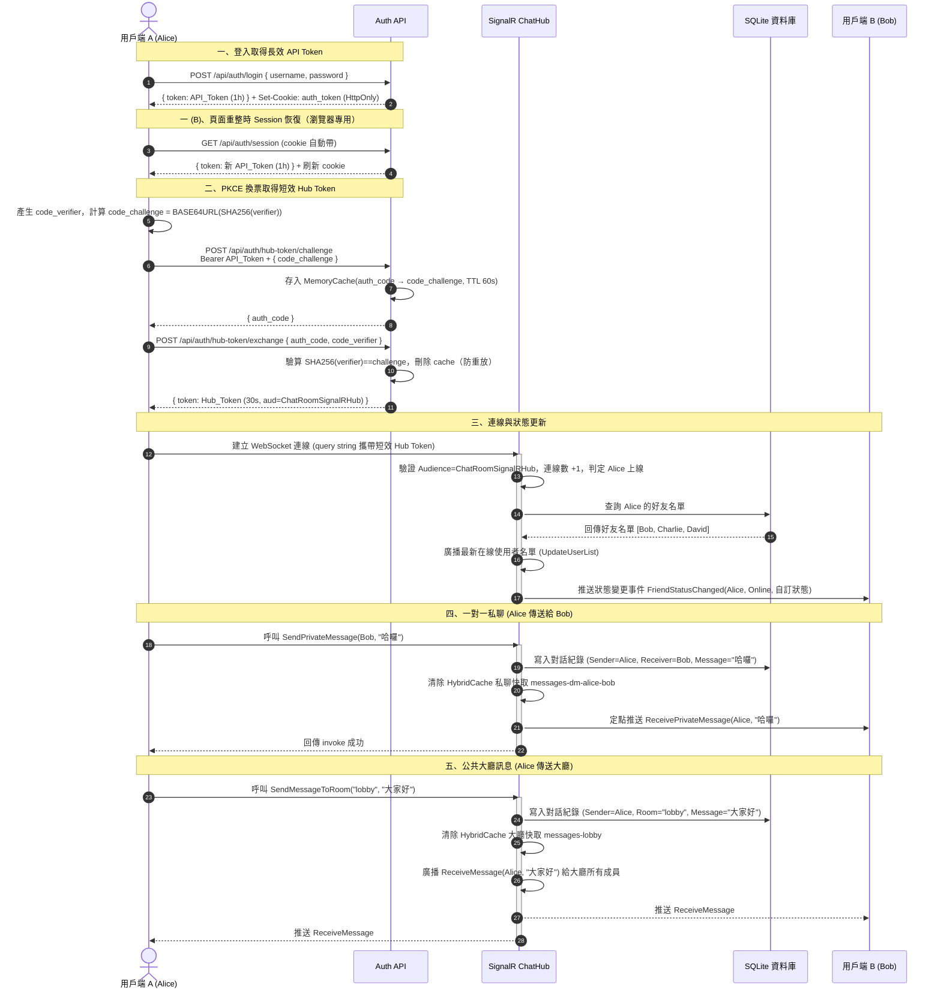

# SignalR 極速聊天室 (.NET 10)

本專案是一個基於 **.NET 10 Minimal APIs** 與 **ASP.NET Core SignalR** 開發的高效即時聊天室。系統整合了 JWT 二階段安全認證、即時好友機制、在線與自訂狀態追蹤，並採用前端 Glassmorphism 毛玻璃視覺設計與後端 HybridCache 快取優化。

---

## 🛠️ 技術堆疊

* **後端架構**：
  * .NET 10 (C#) Minimal APIs + Controllers
  * ASP.NET Core SignalR (即時雙向通訊)
  * Entity Framework Core + SQLite (資料儲存)
  * Microsoft.Extensions.Caching.Hybrid (HybridCache 高效快取)
  * Microsoft.Extensions.Caching.Memory (PKCE auth_code 一次性暫存)
  * PBKDF2-SHA256 (`Rfc2898DeriveBytes.Pbkdf2`，密碼雜湊，.NET 內建)
  * HttpOnly Cookie Session (瀏覽器 Session 持久化，App 端不受影響)
  * Content Security Policy Middleware (XSS 防護)
* **前端架構**：
  * 原生 HTML5 & CSS3 (Glassmorphism 磨砂玻璃風格)
  * Vanilla JavaScript (原生 JS)
  * SignalR JavaScript Client (`cdnjs.cloudflare.com` CDN)
  * `sessionStorage` (記錄連線狀態，頁面重整後自動重連)

---

## 🔒 認證流程 (JWT + PKCE 三階段驗證)

為保障通訊安全且避免 WebSocket 握手階段將 Token 明文暴露於 URL 中，系統採用了 PKCE（Proof Key for Code Exchange）三階段 Token 交換驗證機制：



1. **API 長效 Token**：
   * 用戶端登入後，透過 `POST /api/auth/login` 取得長效 Token (JWT，效期 1 小時)。
   * 同時設定 `HttpOnly` Cookie（瀏覽器專用），供頁面重整後自動恢復 Session。
   * 端點設有 Rate Limiting（每 60 秒最多 5 次），防止帳號枚舉攻擊。
2. **Session 恢復（瀏覽器專用）**：
   * 頁面載入時呼叫 `GET /api/auth/session`，Server 驗證 Cookie 並回傳新的 API Token，同時刷新 Cookie 到期時間。
   * App 端不使用此機制，繼續以 Bearer Token 存放於 Keychain / Keystore。
3. **PKCE Challenge（換票第一步）**：
   * 用戶端產生 `code_verifier`（32 bytes 隨機字串），計算 `code_challenge = BASE64URL(SHA256(code_verifier))`。
   * 攜帶長效 Token 與 `code_challenge` 呼叫 `POST /api/auth/hub-token/challenge`。
   * Server 驗證 API Token，將 `(username, code_challenge)` 存入 MemoryCache（TTL 60s），回傳一次性 `auth_code`。
4. **PKCE Exchange → SignalR 短效 Hub Token（換票第二步）**：
   * 用戶端攜帶 `auth_code + code_verifier` 呼叫 `POST /api/auth/hub-token/exchange`。
   * Server 驗證 `SHA256(code_verifier) == 儲存的 code_challenge`，驗證後立即刪除 cache（防重放攻擊）。
   * 回傳短效 Hub Token (JWT，效期 30 秒，Audience 限定為 `ChatRoomSignalRHub`)。
   * 此 Token 帶入 SignalR 握手，即使 API Token 遭竊也無法直接換取 Hub Token。

---

## ✨ 核心特色與功能

### 1. 即時好友機制與在線狀態
* **好友資料模型**：建立 `User` (基本資料) 與 `Friendship` (雙向好友關係) 於資料庫中。
* **預設 Seed Data**：登入時，系統會自動在資料庫為使用者建立個人資料，並自動與測試帳號 `Bob`、`Charlie`、`David` 建立好友關係。
* **即時在線圓點**：在側邊欄好友清單中，以**綠色/灰色圓點**即時展示好友的在線狀態。
* **自訂狀態更新**：使用者可於側邊欄輸入自訂狀態訊息並點擊更新，系統將會更新資料庫、清除對應快取，並透過 SignalR 即時廣播通知所有在線上的好友更新畫面。

### 2. 雙重在線狀態校正與自我修復
* **即時廣播通知**：當某位使用者上線（連線數從 0 變 1）或下線（連線數降至 0）時，會經由 Hub 自動發送 `FriendStatusChanged` 事件通知其好友。
* **名單全域比對**：配合 SignalR 廣播的 `UpdateUserList` 在線使用者清單，前端會隨時與好友名單進行比對校正，有效避免因網路瞬斷等原因產生的在線狀態不一致。

### 3. 毛玻璃個人基本資訊 Modal (快取優化)
* 點擊好友右側的「資料」按鈕，可彈出高質感毛玻璃 Modal 視窗，展示該好友的 Email、自我介紹 (Bio) 與自訂狀態。
* 後端採用 .NET 10 的 `HybridCache` 快取機制（快取 Key: `user-profile-{username}`），有效降低頻繁點擊所造成的資料庫讀取負擔。

### 4. 歷史訊息快取優化
* 公共大廳歷史訊息與一對一私聊歷史皆享有 `HybridCache` 快取防禦。
* 當發送新訊息至大廳或私訊好友時，後端會自動清除對應的快取，保證資料一致性。

---

## 🌐 API 路由與 SignalR 事件說明

### 1. REST API 端點

**認證**

| 方法 | 路徑 | 說明 | 驗證 |
|------|------|------|------|
| `POST` | `/api/auth/login` | 登入取得 API Token，同時設定 HttpOnly Cookie；Rate Limiting: 每 60 秒 5 次 | 無 |
| `GET` | `/api/auth/session` | 以 Cookie 恢復 Session，回傳新 API Token 並刷新 Cookie 到期時間（瀏覽器專用） | Cookie |
| `POST` | `/api/auth/logout` | 清除 auth_token Cookie，回傳 204 | Cookie |
| `POST` | `/api/auth/hub-token` | 取得 SignalR 短效 Hub Token（簡易版，無 PKCE） | Bearer |
| `POST` | `/api/auth/hub-token/challenge` | PKCE 第一步：驗證 API Token + code_challenge，回傳一次性 auth_code | Bearer |
| `POST` | `/api/auth/hub-token/exchange` | PKCE 第二步：驗證 auth_code + code_verifier，回傳短效 Hub Token（30s） | 無 |

**資料**

| 方法 | 路徑 | 說明 | 驗證 |
|------|------|------|------|
| `GET` | `/api/rooms/{roomName}/messages` | 取得公共房間歷史訊息 | Bearer |
| `GET` | `/api/messages/dm/{targetUsername}` | 取得一對一私聊歷史（具 HybridCache） | Bearer |
| `GET` | `/api/users/{username}` | 取得使用者個人檔案（具 HybridCache） | Bearer |
| `GET` | `/api/friends` | 取得好友名單與在線狀態 | Bearer |
| `POST` | `/api/friends/add` | 新增好友 | Bearer |

### 2. SignalR Hub 事件 (ChatHub)
* **客戶端呼叫伺服器 (Invokes)**：
  * `SendMessageToRoom(roomName, message)` : 發送訊息到大廳房間。
  * `SendPrivateMessage(targetUser, message)` : 發送一對一私聊訊息給指定使用者。
  * `JoinRoom(roomName)` : 加入房間群組。
  * `LeaveRoom(roomName)` : 離開房間群組。
  * `UpdateStatusMessage(message)` : 更新當前使用者狀態訊息並廣播給在線好友。
* **伺服器推送客戶端 (Clients)**：
  * `ReceiveMessage(user, message)` : 接收來自大廳的訊息。
  * `ReceivePrivateMessage(sender, message)` : 接收來自指定好友的私訊。
  * `UpdateUserList(users)` : 接收最新全網在線名單，前端用以校正好友在線狀態。
  * `FriendStatusChanged(username, isOnline, statusMessage)` : 接收特定好友的狀態/狀態訊息更新通知。
  * `ReceiveNotification(message)` : 接收系統日誌通知。

---

## 🚀 啟動與測試指引

### 1. 初始化資料庫 (清除舊資料以套用新 Schema)
若本機已存在舊版資料庫檔案，請於終端機執行清除，使其於重啟時重新套用 `User` 與 `Friendship` Schema：
```bash
rm -f chatroom.db*
```

### 2. 建置專案
```bash
dotnet build
```

### 3. 背景啟動伺服器
```bash
dotnet run --launch-profile http
```
啟動後伺服器將會監聽 `http://0.0.0.0:5158`，並建立 Seed 測試好友資料。

### 4. 帳號建立與登入

本系統採用「**首次登入即建立帳號**」機制，無需獨立的註冊流程：

| 情境 | 行為 |
|------|------|
| 使用者名稱**不存在** | 以輸入的密碼建立帳號，並自動與 Bob / Charlie / David 建立好友關係 |
| 使用者名稱**已存在** | 驗證密碼；正確 → 登入取得 Token，錯誤 → 401 |

> ⚠️ 密碼一旦設定後無法更改（本專案未實作忘記密碼功能），請務必記住第一次輸入的密碼。

密碼儲存採用 **PBKDF2-SHA256**（10 萬次迭代 + 隨機 Salt），由 `Services/PasswordHasher.cs` 統一處理，不儲存明文。

### 5. Seed 帳號
系統啟動時會自動建立三位種子帳號，作為新用戶的預設好友：

| 帳號 | 密碼 | Email |
|------|------|-------|
| Bob | `bob123` | `bob@example.com` |
| Charlie | `charlie123` | `charlie@example.com` |
| David | `david123` | `david@example.com` |

### 6. 瀏覽器測試
使用瀏覽器開啟 **`http://localhost:5158`**（WSL2 環境請改用 WSL 實體網卡 IP，如 `http://<WSL_IP>:5158`），輸入使用者名稱與密碼即可登入。首次輸入新名稱時會自動建立帳號。
